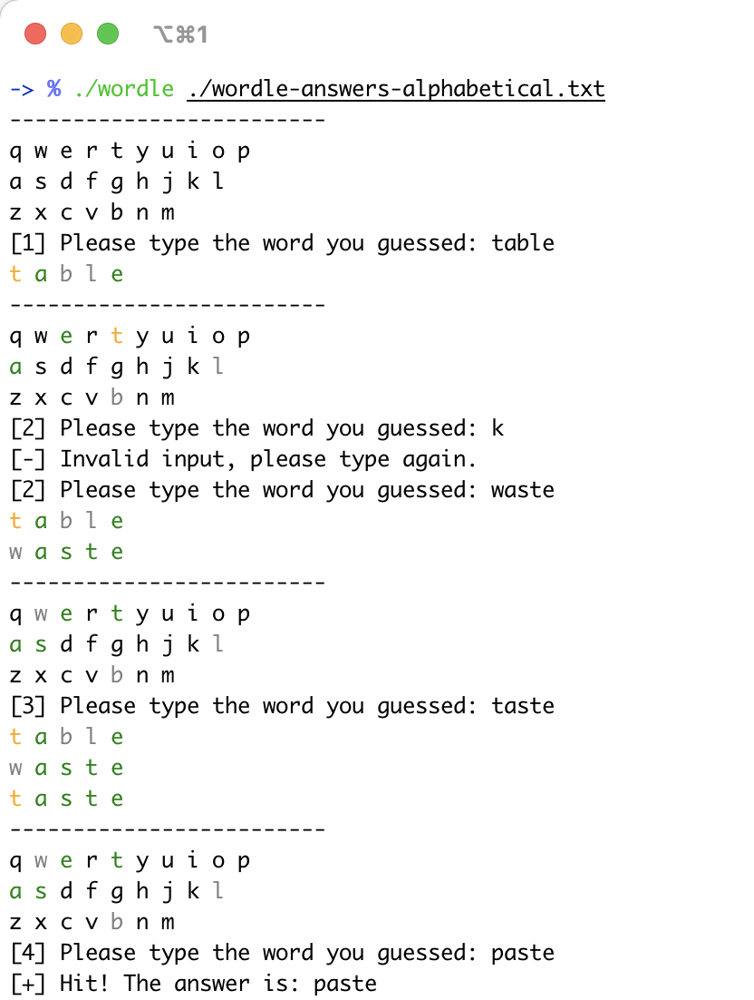

# wordle-cpp
Terminal-based [WORDLE](https://www.powerlanguage.co.uk/wordle/) game written in cpp.

## Build & Run

This project depends on `fmt` library for colorful text output and C++11 supported compiler.

```bash
# build 
make
# run
./wordle ./wordle-answers-alphabetical.txt
```

## Screenshots



## TODO

- Use `ncurses` TUI